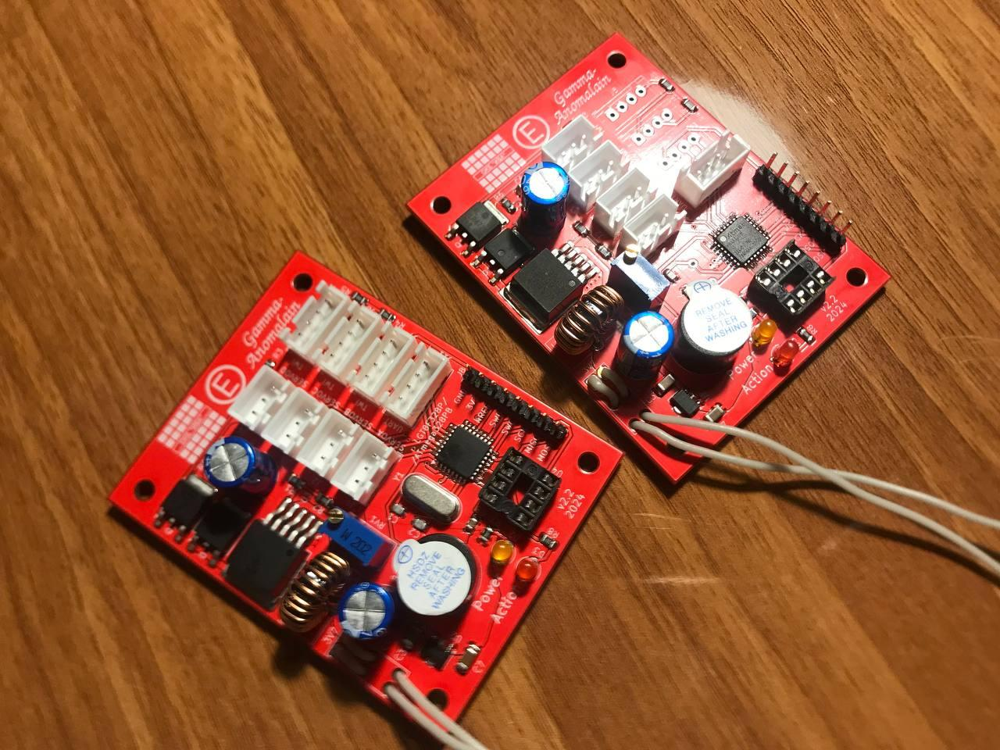

# Barsotion GBK GammaAnomalain

Board computer created for "OKB Iva "Kilka"", 2024

## Parameters
- Microcontroller: ATmega328PB / LGT8X328P
- Clock frequency: 16MHz / 32MHz
- Gyroscope: external, MPU6050 (I2C)
- Barometer: external, 2x BMP388 (I2C)
- Memory: 8MB SPI NOR Flash
